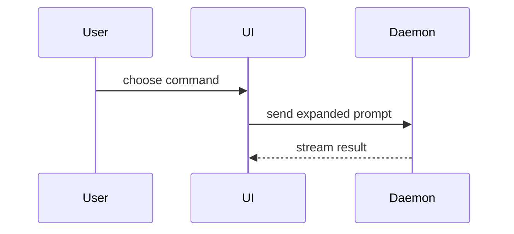

Help the user understand the current topic of conversation visually. Skip the preamble and keep prose brief. Pick the smallest view that makes the key point clear.

Always deliver the answer as one HTML file styled to look like a terminal, then open it. Do not print the views in the chat reply. See "output" below. Your chat reply is one line naming the file.

Pick the view first, using the list below. The code blocks show what each view contains, not where it goes.

- Show logic or an algorithm as pseudocode:

```text
on(save)
  if content is unchanged
    return cached result
  write new content
  return fresh result
```

- Show runtime control flow as a call tree:

```text
submitForm
  createSession
    persistPrompt
    launchAgent
  navigateToSession
```

- Show UI structure as a component tree, including state and module boundaries that matter:

```tsx
<SessionPage> (apps/example/src/routes/session.tsx)
  useSessionEvents()
  <SessionToolbar>
    <RunSkillButton> (packages/ui)
```

- Show file responsibility or a broad refactor as a shallow file tree:

```text
src/
├── commands/       # parses user actions
├── sessions/       # owns session state
└── transport/      # sends API requests
```

- Show component interaction, control flow, or data flow with Mermaid:



- Use `diff` when the point is what changes and the surrounding shape already exists. Match the diff shape to the topic.

For a component change:

```diff
 <SessionPage>
   useSessionEvents()
   <SessionToolbar>
+    <RunSkillButton />
   <SessionTimeline>
+    <SkillResultCard />
```

For a file-layout change:

```diff
 src/
 ├── commands/
+│   └── show-me.ts       # expands the slash command
 ├── sessions/
-└── transport.ts
+└── transport/
+    ├── client.ts
+    └── stream.ts
```

For a call-tree or call-stack change:

```diff
 submitForm
   createSession
     persistPrompt
+    expandSkillMention
     launchAgent
-  navigateToSession
+  navigateToSession
+    subscribeToEvents
```

For a state or control-flow change:

```diff
 on(save)
-  write content
+  if content is unchanged
+    return cached result
+  write new content
+  invalidate cache
```

- Show the whole block when most of it is new, when omitted context would hide ownership or order, or when the user needs a copyable target shape:

```ts
function expandSkill(command: string): string {
  const skillName = command.slice(1)
  return `use the ${skillName} skill`
}
```

- For a visual UI, layout, state comparison, or concept too dense for a Mermaid diagram, drop the terminal block and use real HTML — a boxed diagram, an infographic, or a short slide deck, whichever fits the point. Match the product's colors, type, spacing, and components; use real labels and data. Do this only when a monospace block genuinely cannot carry the point.

  On this path only, invoke the `dataviz` skill first and follow its color, layout, and labeling rules. Skip `dataviz` for the terminal blocks and for Mermaid diagrams.

### output

Write one file named `show-me-{description}.html` in the working directory, then open it:

```
Bash(open show-me-{description}.html)
```

Style it as a terminal. Use these rules:

- Dark background, light foreground, one monospace font stack.
- Render every view from the list above as a preformatted monospace block. Keep the exact spacing, box-drawing characters, and indentation.
- Color `diff` blocks by line: green for `+`, red for `-`, muted for context.
- Cap the content width for reading. Left-align everything.
- Support desktop and mobile.

Render Mermaid diagrams in the page with the Mermaid script from a CDN and a dark theme, so they sit alongside the terminal blocks.

Do not add a toolbar, tabs, navigation, animation, or a fake prompt and cursor. The terminal look is for reading comfort, not decoration.

### guidance

In the page, place each visual next to the short text it supports. Keep only the calls, files, props, states, and boundaries needed to answer the user's current question or the options to resolve the current discussion point.

You may use one of these, you may use several, it is unlikely you will use all of them. Use your judgement and don't overwhelm the user.
